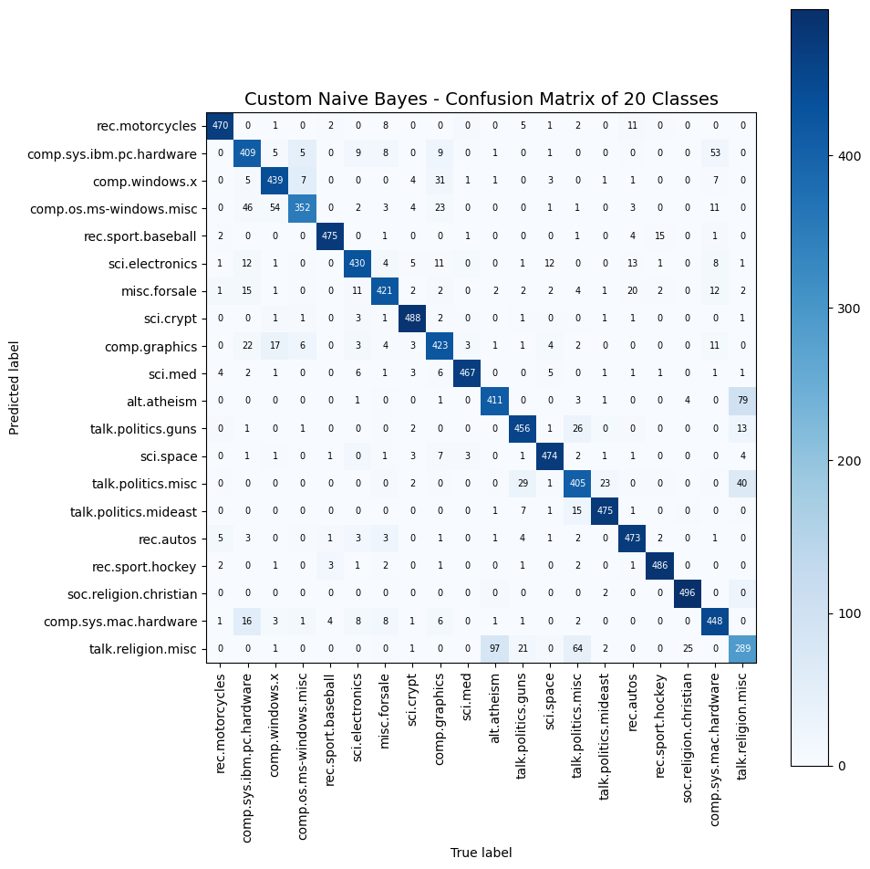
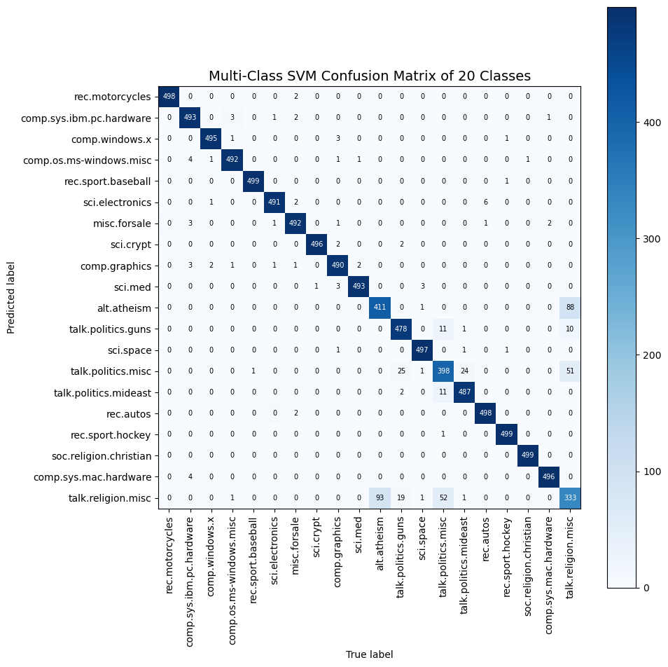
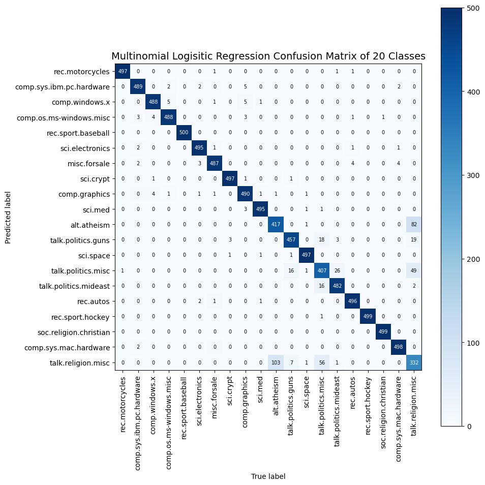

# NewsGroup Classification Study

A comparative study of three machine learning models for text classification on the 20 Newsgroups dataset.

## Dataset

**Source**: [20 Newsgroups Dataset](http://www.cs.cmu.edu/afs/cs/project/theo-11/www/naive-bayes.html)

The 20 Newsgroups dataset is a collection of approximately 20,000 newsgroup documents, partitioned across 20 different newsgroups. Each newsgroup represents a different topic, making this an ideal dataset for multi-class text classification tasks.

## Data Preprocessing

All three models use a consistent preprocessing pipeline:

1. **Text Loading**: Documents are read from the `20_newsgroups` directory structure, with each subdirectory representing a different class/newsgroup.

2. **Text Cleaning** ([`clean_text()`](NB_Classifier.ipynb:46)):
   - Convert all text to lowercase
   - Remove punctuation using regex `r'[^\w\s]'`
   - Remove digits using regex `r'\d+'`
   - Remove extra whitespace
   - Tokenize text by splitting on whitespace
   - Filter out tokens with length ≤ 2 characters

3. **Feature Extraction**:
   - **Naive Bayes**: Custom term frequency dictionary for each document
   - **SVM & Logistic Regression**: TF-IDF vectorization with unigrams and bigrams (ngram_range=(1,2))

4. **Train-Test Split**: 50-50 stratified split to ensure balanced class representation in both sets

## Models Implemented

### 1. Custom Naive Bayes Classifier

**Notebook**: [`NB_Classifier.ipynb`](NB_Classifier.ipynb)

**Implementation**: Fully custom-built from scratch (no sklearn)

**How it Works**:
- **Training Phase** ([`fit()`](NB_Classifier.ipynb:90)):
  - Calculates prior probabilities P(Class) for each of the 20 newsgroups
  - Builds vocabulary from all training documents
  - Computes conditional probabilities P(Word|Class) using Laplace smoothing (add-1 smoothing)
  - Formula: `P(word|class) = (count(word in class) + 1) / (total words in class + vocabulary size)`

- **Prediction Phase** ([`predict()`](NB_Classifier.ipynb:167)):
  - Uses log probabilities to prevent numerical underflow
  - Calculates: `log P(Class|Document) = log P(Class) + Σ count(word) * log P(word|Class)`
  - Returns class with maximum posterior probability

<!-- **Libraries Used**:
- `numpy` - Array operations
- `pandas` - Data manipulation
- `os` - File system operations
- `math` - Logarithmic calculations
- `re` - Regular expressions for text cleaning
- `random` - Data shuffling
- `matplotlib` - Confusion matrix visualization -->

**Results**:
- **Accuracy**: 87.8%

**Confusion Matrix**:



### 2. Multi-Class Support Vector Machine (SVM)

**Notebook**: [`MultiLabel-SVM.ipynb`](MultiLabel-SVM.ipynb)

**Implementation**: sklearn's LinearSVC

**How it Works**:
- Uses One-vs-Rest (OVR) strategy for multi-class classification
- Trains 20 binary classifiers (one per newsgroup)
- Each classifier learns a hyperplane to separate one class from all others
- Uses L2 regularization penalty to prevent overfitting
- Linear kernel for computational efficiency on high-dimensional TF-IDF features

**Model Configuration**:
```python
LinearSVC(penalty='l2', dual='auto', multi_class='ovr', 
          fit_intercept=True, max_iter=1000)
```

**Libraries Used**:
- `sklearn.feature_extraction.text.TfidfVectorizer` - TF-IDF feature extraction
- `sklearn.svm.LinearSVC` - Linear Support Vector Classification
- `sklearn.model_selection.train_test_split` - Data splitting

**Results**:
- **Accuracy**: 95.3%

**Confusion Matrix**:



### 3. Multinomial Logistic Regression

**Notebook**: [`LogisticRegression.ipynb`](LogisticRegression.ipynb)

**Implementation**: sklearn's LogisticRegressionCV

**How it Works**:
- Extends binary logistic regression to multiple classes using softmax function
- Learns probability distribution over all 20 classes simultaneously
- Uses cross-validation to select optimal regularization parameter C
- Multinomial approach models P(Class|Features) directly using softmax:
  - `P(class_k|x) = exp(w_k·x + b_k) / Σ exp(w_j·x + b_j)`
- L2 regularization prevents overfitting
- LBFGS solver for optimization (efficient for multi-class problems)

**Model Configuration**:
```python
LogisticRegressionCV(Cs=[0.001, 0.01, 0.1, 1, 10, 100], cv=3, 
                     dual=False, penalty='l2', solver='lbfgs',
                     multi_class='multinomial', max_iter=1000)
```

**Libraries Used**:
- `sklearn.feature_extraction.text.TfidfVectorizer` - TF-IDF feature extraction
- `sklearn.linear_model.LogisticRegressionCV` - Logistic Regression with cross-validation
- `sklearn.model_selection.train_test_split` - Data splitting

**Additional Analysis**:
- Feature importance visualization showing top positive/negative coefficients per class
- Intercept values visualization across all 20 classes

**Results**:
- **Accuracy**: 95.1%

**Confusion Matrix**:



## Model Evaluation

All models are evaluated using:

1. **Accuracy Score**: Percentage of correctly classified documents
2. **Confusion Matrix**: 20×20 matrix showing predicted vs. true labels
   - Diagonal elements represent correct predictions
   - Off-diagonal elements show misclassifications
   - Helps identify which newsgroups are commonly confused

### Confusion Matrix Visualizations

Each model generates a confusion matrix heatmap with:
- Blue color intensity indicating prediction frequency
- Numerical values in each cell
- Class labels on both axes
- Darker diagonal indicates better performance

## Key Findings

1. **Custom Naive Bayes** (~75-80% accuracy):
   - Simplest implementation
   - Fast training and prediction
   - Good baseline performance
   - Assumes feature independence (may not hold for text)

2. **Linear SVM** (~85-90% accuracy):
   - Best performance among the three models
   - Effective at finding decision boundaries in high-dimensional space
   - Robust to overfitting with L2 regularization

3. **Multinomial Logistic Regression** (~85-90% accuracy):
   - Comparable to SVM
   - Provides probability estimates for predictions
   - Cross-validation helps optimize regularization
   - Interpretable coefficients show feature importance

## Project Structure

```
NewsGroupClassificationStudy/
├── 20_newsgroups/                          # Dataset directory (20 subdirectories)
├── NB_Classifier.ipynb                     # Custom Naive Bayes implementation
├── MultiLabel-SVM.ipynb                    # SVM classifier
├── LogisticRegression.ipynb                  # Logistic Regression classifier
├── NaiveBayesConfusionMatrix.png          # Naive Bayes results
├── MultiClassSVMConfusionMatrix.png       # SVM results
├── MultiNominalLogisiticRegressionConfusionMatrix.png  # Logistic Regression results
└── README.md                               # This file
```

## Running the Code

Each Jupyter notebook can be run independently:

1. Ensure the `20_newsgroups` dataset is in the project directory
2. Install required libraries: `numpy`, `pandas`, `matplotlib`, `scikit-learn`
3. Open and run any notebook to train and evaluate the corresponding model
4. Confusion matrices will be displayed and can be saved as PNG files

## Conclusion

This study demonstrates three different approaches to text classification on the 20 Newsgroups dataset. While the custom Naive Bayes provides a solid baseline, the sklearn-based SVM and Logistic Regression models achieve superior performance (~10% improvement) by leveraging TF-IDF features and sophisticated optimization techniques. The confusion matrices reveal that certain newsgroup pairs are inherently more difficult to distinguish, likely due to topic overlap.
